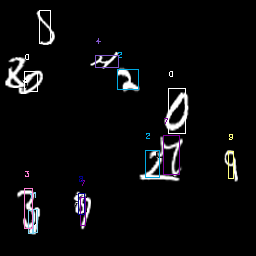
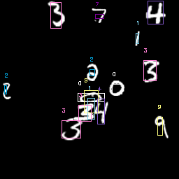

# Text instance segmentation with yolo

This repo is meant to be used with darkflow https://github.com/thtrieu/darkflow

The ipython notebook includes scripts to generate data for training. One version generates 2 overlapping mnist digits in a 40x40 image, the other generates multiple mnist digits scaled between 0.5 and 2, scattered uniformly on a 256x256 blank canvas. Both store generated results in Pascal VOC format suitable for use with darkflow.

The config folder have stable working configurations for input size 40 and 256. To train, install darkflow then execute the following:

flow --model path/to/config/file.cfg --dataset path/to/train/images/ --annotation path/to/train/labels/ --train --trainer adam --lr 0.01 --save 500 --gpu 1.0

To run inference:

flow --imgdir path/to/images/ --model path/to/config/file.cfg --gpu 1.0

To output json:

flow --imgdir path/to/images/ --model path/to/config/file.cfg --gpu 1.0 --json

Results after 2 epochs, 55000 training examples per epoch:

Trouble-shooting:

- Loss stops decreasing but no bounding box detected: keep training 2-3 more epochs.
- If you have cuda memory allocation problem when running darkflow, try stopping all processes using gpu resources (gdm3 and Xorg), switch to a tty and train there instead.